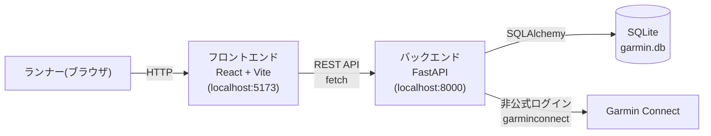

# 01. システム概要

## 目的・背景

Garminで記録した走行データ（ランニング等）を一元的に管理し、将来的にはカレンダー表示や分析機能を通じてトレーニングの振り返りを支援するアプリを開発する。本ドキュメントが対象とするのはその第一段階（MVP）であり、Garmin Connectからアクティビティデータを取得し、データベースに保存し、Web画面に一覧表示するところまでを扱う。

## スコープ

### 対象（今回のMVP）
- Garmin Connectからのアクティビティデータ取得（非公式ログイン）
- 取得データのローカルデータベースへの保存
- Web画面でのアクティビティ一覧表示
- アクティビティ一覧画面における、直近7日間・直近28日間の合計走行距離・合計時間のサマリー表示（ランニングのみ対象）

### 対象外（将来検討）
- カレンダー表示（日別・月別のトレーニング可視化）
- 分析機能（トレーニング負荷、ペース分布、心拍ゾーン分析など）
  - 単純な合計値の期間集計（サマリー表示）はここでいう「分析機能」には含まない。ここでの分析機能とは、トレーニング負荷指数の算出、ペース分布、心拍ゾーン分析など、複合的な計算・可視化を伴うものを指す。
- 複数ユーザー対応、認証・ログイン画面（個人利用が前提）
- 常時稼働・クラウドデプロイ（ローカル実行が前提）

これらは [04_DB設計](04_DB設計.md) で触れる `raw_json` 列の保持など、将来の拡張を阻害しない範囲でのみ考慮する。

## 用語定義

| 用語 | 説明 |
|---|---|
| アクティビティ | Garmin Connectに記録された1回の運動記録（ランニング、ウォーキング、サイクリング等） |
| 同期 (sync) | Garmin Connectから最新のアクティビティを取得し、ローカルDBに反映する処理 |
| トークンキャッシュ | Garmin Connectへの再ログインを省略するために保存する認証セッション情報 |
| ランナー | 本アプリの利用者本人（開発者自身） |

## システム構成図

個人のローカル環境で完結する構成。フロントエンド（Vite開発サーバー）とバックエンド（FastAPI）を別プロセスで起動し、バックエンドがSQLiteとGarmin Connectの両方にアクセスする。

## 関連ドキュメント

- 機能一覧: [02_機能一覧.md](02_機能一覧.md)
- 画面設計: [03_画面設計.md](03_画面設計.md)
- DB設計: [04_DB設計.md](04_DB設計.md)
- API設計: [05_API設計.md](05_API設計.md)
- 外部インターフェース設計: [06_外部インターフェース設計.md](06_外部インターフェース設計.md)
- 非機能要件: [07_非機能要件.md](07_非機能要件.md)
- セットアップ手順: [../PLAN.md](../PLAN.md)
