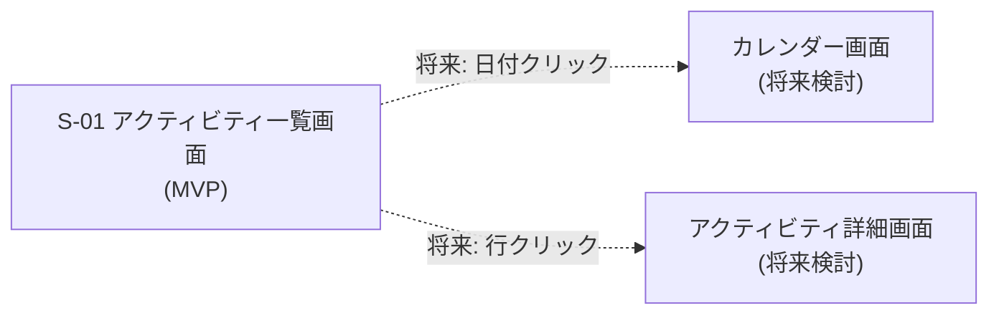
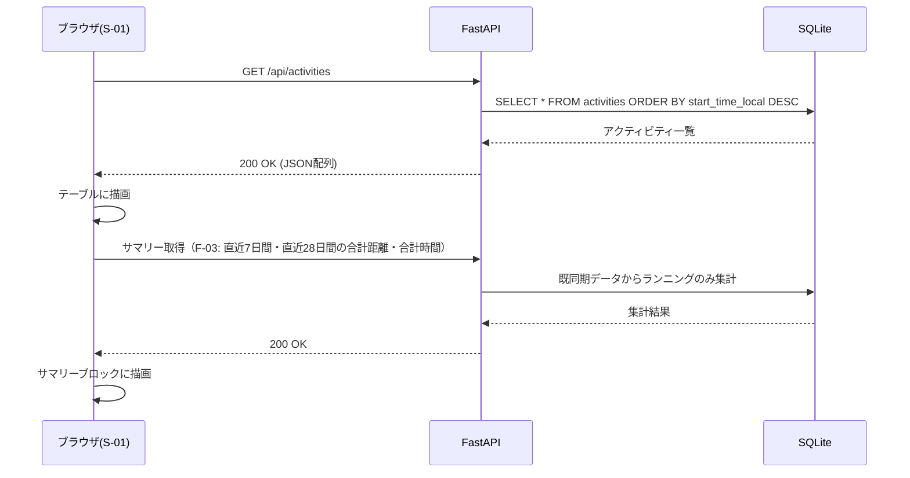
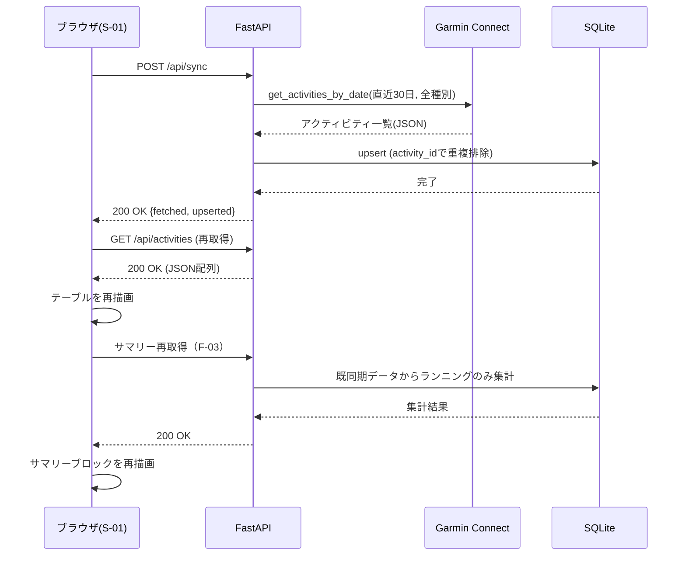

# 03. 画面設計

## 画面一覧

MVPでは以下の1画面のみ。

| 画面ID | 画面名 | 概要 |
|---|---|---|
| S-01 | アクティビティ一覧画面 | F-01（同期）・F-02（一覧表示）を提供するメイン画面 |

## レイアウト（S-01 アクティビティ一覧画面）

```
┌──────────────────────────────────────────────┐
│ Garmin Activity Tracker          [同期ボタン]  │
├──────────────────────────────────────────────┤
│ 直近7日間  合計距離 21.4km / 合計時間 2時間10分  │
│ 直近28日間 合計距離 98.6km / 合計時間 9時間45分  │
│ ※ランニングのみ集計                            │
├──────────────────────────────────────────────┤
│ 日付      │種別   │距離   │時間   │ペース │平均心拍│カロリー│
├──────────────────────────────────────────────┤
│ 2026-07-16│running│5.2km │28:30 │5:29/km│152bpm │320kcal │
│ 2026-07-14│walking│3.0km │35:10 │11:43/km│105bpm │180kcal │
│ ...       │       │      │      │       │       │        │
└──────────────────────────────────────────────┘
```

- ヘッダー: アプリ名 + 同期ボタン（[SyncButton.tsx](../frontend/src/components/SyncButton.tsx) 相当）
- サマリーブロック: ヘッダーとテーブルの間に配置。F-03の走行サマリー表示を担う。直近7日間・直近28日間それぞれの合計距離・合計時間を表示する
- サマリーブロックの表記には「直近7日間」「直近28日間」を用い、「週間」「月間」など暦週を想起させる語は使わない
- サマリーブロック付近には「ランニングのみ集計」等の注記を表示し、一覧テーブルの件数・種別（ウォーキング等を含む）と数値が一致しない場合があることをユーザーに明示する
- 対象期間にランニング記録がない場合は「0.0 km / 0時間0分」等の0埋め表示とする。一覧の空状態メッセージとは別扱いとし、サマリー側に特別な空状態文言は設けない
- テーブル本体: [ActivityTable.tsx](../frontend/src/components/ActivityTable.tsx) 相当。列は日付・種別・距離・時間・ペース・平均心拍・カロリー
- 同期ボタン押下中はローディング表示、完了後にテーブルが自動更新される
- 一覧が0件の場合は「アクティビティがありません。同期してください」等の空状態メッセージを表示する

## 画面遷移図

MVPは1画面のみのため遷移はないが、将来のカレンダー画面・詳細画面への拡張ポイントを点線で示す。



## 操作フロー

### 画面表示時（初回ロード）



### 同期ボタン押下時


