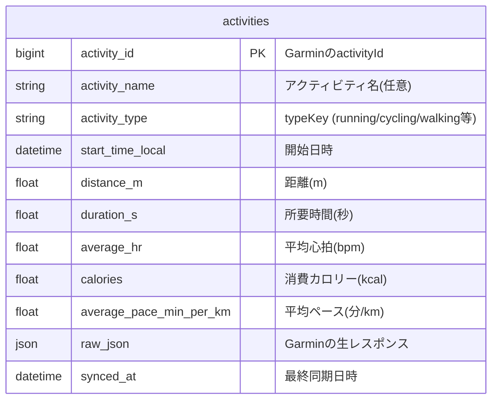

# 04. データベース設計

DBMSはSQLite。ORMはSQLAlchemyを使用し、`Base.metadata.create_all()`でテーブルを作成する（Alembic等のマイグレーションツールは今回不要。詳細は [07_非機能要件](07_非機能要件.md) 参照）。

## ER図

MVPでは `activities` テーブルのみの単純な構成。

## テーブル定義書: `activities`

| カラム名 | 型 | NULL | キー | 説明 |
|---|---|---|---|---|
| `activity_id` | BigInteger | NOT NULL | PK | GarminのactivityId。同期時のupsertキー |
| `activity_name` | String | NULL可 | - | Garmin上のアクティビティ名 |
| `activity_type` | String | NOT NULL | INDEX | typeKey（例: running, cycling, walking） |
| `start_time_local` | DateTime | NOT NULL | INDEX | アクティビティ開始日時（ローカルタイム） |
| `distance_m` | Float | NULL可 | - | 距離（メートル） |
| `duration_s` | Float | NULL可 | - | 所要時間（秒） |
| `average_hr` | Float | NULL可 | - | 平均心拍数（bpm） |
| `calories` | Float | NULL可 | - | 消費カロリー（kcal） |
| `average_pace_min_per_km` | Float | NULL可 | - | 平均ペース（分/km）。同期時に`distance_m`/`duration_s`から算出して保存 |
| `raw_json` | JSON | NULL可 | - | Garmin Connect APIの生レスポンス全体 |
| `synced_at` | DateTime | NOT NULL | - | 最終同期日時（`server_default=now`, `onupdate=now`） |

### 設計メモ

- **`activity_id`を主キーにする理由**: Garmin側のIDをそのまま使うことで、同じアクティビティを重複登録せずに`INSERT ... ON CONFLICT DO UPDATE`によるupsertが可能になる（詳細は [05_API設計](05_API設計.md) の`POST /api/sync`参照）
- **`raw_json`を保持する理由**: MVPで表示しないフィールド（ラップ、GPS経路、高度等）も含めてGarminの生データを保持しておくことで、将来のカレンダー表示・分析機能を追加する際にAPIへの再取得なしにデータを再利用できるようにするため
- **`average_pace_min_per_km`を全種別で保持する理由**: MVPでは種別を問わず統一的な指標として保持する。サイクリング等では本来「速度(km/h)」表示の方が自然だが、種別ごとの表示切り替えは将来検討とする
