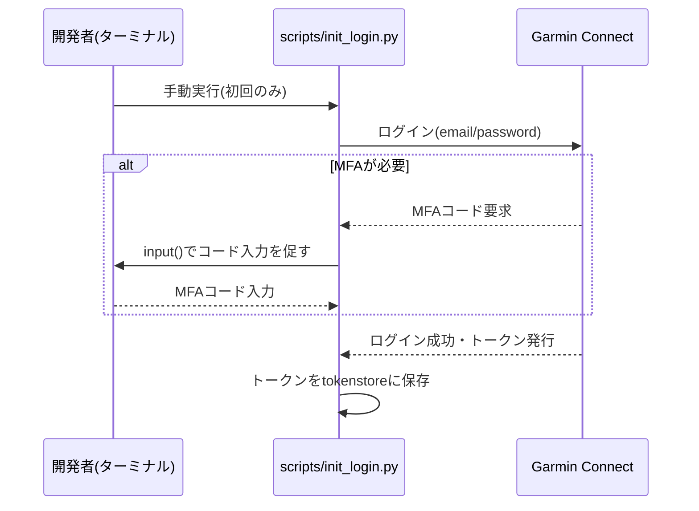

# 06. 外部インターフェース設計

本アプリが連携する唯一の外部システムはGarmin Connectである。

## 連携方式

Garmin Connectは個人利用向けの公式Health APIが存在するが、開発者登録・審査が必要で個人のホビープロジェクトには過剰なため、非公式ライブラリ `garminconnect`（PyPI, cyberjunky/python-garminconnect）による**非公式ログイン**を採用する。同ライブラリは内部で`garth`を用いてGarmin Connect Webのセッションを取得する。

## 認証方式

- `Garmin(email, password, prompt_mfa=...)` でクライアントを生成し、`client.login(tokenstore_path)` でログインする
- ログイン成功時、`garth`がセッショントークンを`tokenstore_path`にキャッシュする。2回目以降の起動ではキャッシュ済みトークンを再利用し、メール/パスワードでの再ログインを省略できる
- 認証情報（`GARMIN_EMAIL` / `GARMIN_PASSWORD`）は`.env`ファイルに保存し、`.gitignore`で除外する（[07_非機能要件](07_非機能要件.md) 参照）

## MFA（多要素認証）対応

`prompt_mfa`コールバックは`input()`によるブロッキング処理となるため、FastAPIのリクエストハンドラ内では使用しない。初回のみ `scripts/init_login.py` を手動実行してトークンキャッシュを作成し、以降 `POST /api/sync` はキャッシュ済みトークンのみで動作する。

## 取得データの範囲

| 項目 | 値 |
|---|---|
| 取得期間 | 直近30日間（`SYNC_LOOKBACK_DAYS`環境変数で変更可能） |
| 取得対象アクティビティ種別 | 全種別（running/cycling/walking等、絞り込みなし） |
| 使用メソッド | `client.get_activities_by_date(start_iso, end_iso)`（`activitytype`引数は省略） |

主なレスポンスフィールド: `activityId`, `activityName`, `activityType.typeKey`, `startTimeLocal`, `distance`(m), `duration`(秒), `averageHR`, `calories`。[04_DB設計](04_DB設計.md) の`activities`テーブルへのマッピングに使用する。

## リスク・留意事項

- 非公式ライブラリであるため、Garmin側の仕様変更により動作しなくなる可能性がある。継続的な保守が必要
- レート制限や短時間の大量アクセスに関する明文化された仕様がないため、同期は手動トリガー（同期ボタン押下時のみ）とし、自動ポーリング等は行わない
- `get_activities_by_date`の正確な引数仕様はライブラリのバージョンによって差異があり得るため、実装時にインストール済みパッケージのdocstringで再確認する
