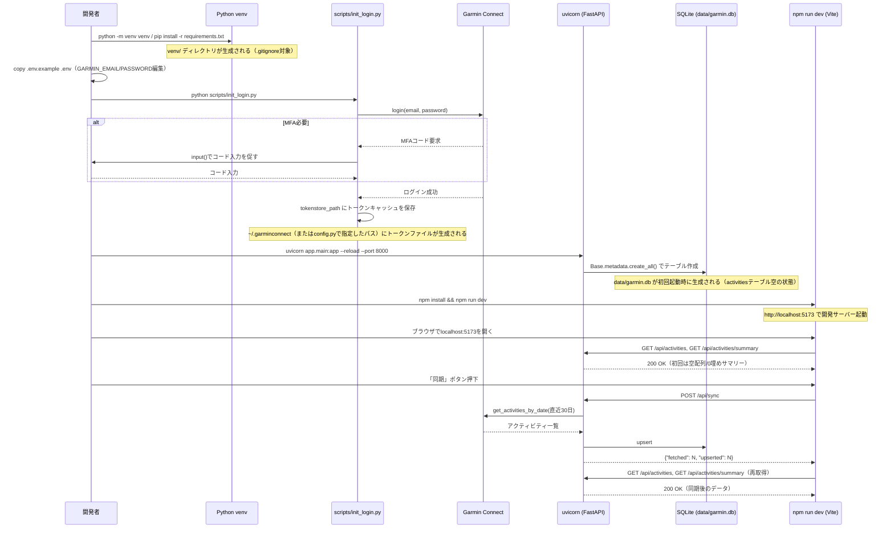

# 08. 詳細設計

基本設計書（[01_システム概要](01_システム概要.md)〜[07_非機能要件](07_非機能要件.md)、gitタグ `v1.0.0-design` で確定済み）およびセットアップ手順書（[../PLAN.md](../PLAN.md)）を踏まえ、実装に着手する前に必要なモジュール単位・関数単位の詳細仕様をまとめる。

本書は基本設計書の内容を変更するものではない。基本設計書と本書の記載に矛盾が疑われる場合は、末尾の「[基本設計書との整合性メモ](#基本設計書との整合性メモ)」に記載する方針に従い、基本設計書側は変更しない。

対象読者は実装担当者（`garmin-coding`）。本書のシグネチャ・処理手順は実装時の初期方針であり、`garminconnect`の実際のインストール済みバージョンのdocstring等で齟齬が判明した場合は、動作を優先して調整してよい（その場合も本書を追随して更新することが望ましい）。

## 全体構成

```
garmin/
├── backend/
│   ├── requirements.txt
│   ├── .env.example
│   ├── scripts/
│   │   └── init_login.py
│   ├── data/                      # garmin.db (gitignore対象)
│   └── app/
│       ├── main.py
│       ├── config.py
│       ├── database.py
│       ├── models.py
│       ├── schemas.py
│       ├── garmin_client.py
│       ├── sync.py
│       ├── pace.py
│       ├── summary.py             # F-03 走行サマリー集計（下記「基本設計書との整合性メモ」参照）
│       └── routers/
│           └── activities.py
└── frontend/
    └── src/
        ├── App.tsx
        ├── App.css
        ├── main.tsx
        ├── types.ts
        ├── api/
        │   └── client.ts
        ├── components/
        │   ├── ActivityTable.tsx
        │   ├── SyncButton.tsx
        │   └── SummaryPanel.tsx   # F-03 サマリーブロック表示
        └── utils/
            └── format.ts
```

`backend/app/summary.py` と `frontend/src/components/SummaryPanel.tsx` はPLAN.mdには記載がないが、確定済みの基本設計書（[02_機能一覧](02_機能一覧.md) F-03、[03_画面設計](03_画面設計.md)）に対応するために本書で追加するモジュールである。詳細は「[基本設計書との整合性メモ](#基本設計書との整合性メモ)」を参照。

---

## バックエンド モジュール詳細

### `config.py`

**責務**: `.env`の読み込みと、アプリ全体で共有する設定値の一元管理。他モジュールは環境変数を直接読まず、必ずこのモジュール経由で値を参照する。

```python
class Settings:
    garmin_email: str
    garmin_password: str
    sync_lookback_days: int = 30        # SYNC_LOOKBACK_DAYS（未設定時30。06_外部インターフェース設計 参照）
    database_url: str = "sqlite:///./data/garmin.db"
    tokenstore_path: str = "~/.garminconnect"  # garthのトークンキャッシュ保存先
    cors_allow_origin: str = "http://localhost:5173"

def get_settings() -> Settings: ...
```

- `python-dotenv`の`load_dotenv()`を最初に呼び、`os.environ`から上記フィールドを読み込んだ`Settings`インスタンスを返す
- `garmin_email`/`garmin_password`が未設定の場合は起動時に例外を送出せず、`garmin_client.py`側の呼び出し時に初めてエラーにする（`GET /api/activities`はGarmin認証情報がなくても動作できるようにするため。DBのみで完結する経路を認証情報の有無で壊さない）
- `get_settings()`は`functools.lru_cache`等でプロセス内シングルトンにし、`routers/activities.py`からは`Depends(get_settings)`で注入する

### `database.py`

**責務**: SQLAlchemyのエンジン・セッション・Base・DIヘルパーの定義。

```python
engine: Engine                          # create_engine(settings.database_url, connect_args={"check_same_thread": False})
SessionLocal: sessionmaker
Base: DeclarativeBase

def get_db() -> Generator[Session, None, None]: ...   # FastAPIのDependsで使うジェネレータ。yield後にclose()
```

- SQLiteはデフォルトでは同一スレッドからのみ接続可能なため、`connect_args={"check_same_thread": False}`を付与する（FastAPIのDepends注入がリクエストごとに異なるスレッドを使い得るため）
- `database_url`が指す`data/`ディレクトリが存在しない場合、`engine`生成前に`Path("data").mkdir(exist_ok=True)`しておく（初回起動時にディレクトリが無くて失敗するのを防ぐ）

### `models.py`

**責務**: `Activity` ORMモデルの定義のみ。ビジネスロジックは持たない。

```python
class Activity(Base):
    __tablename__ = "activities"

    activity_id: Mapped[int] = mapped_column(BigInteger, primary_key=True)
    activity_name: Mapped[str | None] = mapped_column(String, nullable=True)
    activity_type: Mapped[str] = mapped_column(String, nullable=False, index=True)
    start_time_local: Mapped[datetime] = mapped_column(DateTime, nullable=False, index=True)
    distance_m: Mapped[float | None] = mapped_column(Float, nullable=True)
    duration_s: Mapped[float | None] = mapped_column(Float, nullable=True)
    average_hr: Mapped[float | None] = mapped_column(Float, nullable=True)
    calories: Mapped[float | None] = mapped_column(Float, nullable=True)
    average_pace_min_per_km: Mapped[float | None] = mapped_column(Float, nullable=True)
    raw_json: Mapped[dict] = mapped_column(JSON, nullable=True)
    synced_at: Mapped[datetime] = mapped_column(
        DateTime, server_default=func.now(), onupdate=func.now(), nullable=False
    )
```

[04_DB設計](04_DB設計.md)のテーブル定義書とカラム構成は1:1対応。SQLAlchemy 2.0系の`Mapped`/`mapped_column`記法を用いる（`declarative_base()`スタイルでも可だが、型ヒントの明確さを優先しこちらを既定とする）。

### `schemas.py`

**責務**: APIレスポンス用Pydanticモデルの定義。ORMモデルとは分離し、`raw_json`のような内部専用フィールドを外部に漏らさないための境界とする。

```python
class ActivityOut(BaseModel):
    activity_id: int
    activity_name: str | None
    activity_type: str
    start_time_local: datetime
    distance_m: float | None
    duration_s: float | None
    average_hr: float | None
    calories: float | None
    average_pace_min_per_km: float | None

    model_config = ConfigDict(from_attributes=True)   # ORMインスタンスから直接変換可能にする


class SyncResult(BaseModel):
    fetched: int
    upserted: int


class RunningSummary(BaseModel):
    distance_m: float          # 対象期間内・running種別のみの合計距離(m)。該当なしは0.0
    duration_s: float          # 同上、合計時間(秒)。該当なしは0.0


class ActivitySummaryOut(BaseModel):
    last_7_days: RunningSummary
    last_28_days: RunningSummary
```

- `ActivityOut`は[05_API設計](05_API設計.md)の`GET /api/activities`レスポンス例と1:1対応。`raw_json`と`synced_at`は含めない
- `ActivitySummaryOut`は[02_機能一覧](02_機能一覧.md) F-03 / [03_画面設計](03_画面設計.md)のサマリーブロックに対応するレスポンス（エンドポイントの扱いは後述の整合性メモを参照）

### `garmin_client.py`

**責務**: Garmin Connectとの通信をラップし、他モジュール（`sync.py`等）に対してGarmin固有のAPI形状を意識させない。

```python
def get_client() -> Garmin:
    """
    garminconnect.Garmin インスタンスを生成し、tokenstore_path からトークンキャッシュを
    ロードしてログイン済み状態で返す。
    - prompt_mfa は渡さない（FastAPIのリクエストハンドラ内でブロッキング入力を発生させないため）。
    - トークンキャッシュが存在しない/失効している場合は例外を送出する
      （scripts/init_login.py の未実行、またはキャッシュ失効を示すメッセージにする）。
    - プロセス内でクライアントを使い回すためのキャッシュは行わない（MVPでは呼び出し頻度が
      低く、同期ボタン押下のたびに生成しても性能上の問題はないため。07_非機能要件 参照）。
    """

def fetch_recent_activities(days: int) -> list[dict]:
    """
    直近 `days` 日分・全種別のアクティビティをGarmin Connectから取得して返す。

    処理:
      1. get_client() でログイン済みクライアントを取得
      2. end = date.today(), start = end - timedelta(days=days)
      3. client.get_activities_by_date(start.isoformat(), end.isoformat())
         を呼ぶ（activitytype引数は省略し全種別取得。06_外部インターフェース設計 参照）
      4. 戻り値（Garminの生JSON配列。各要素は dict）をそのまま list[dict] として返す
         （このレイヤーでは加工・フィールド抽出を行わない。マッピングは sync.py の責務とする）

    戻り値の各要素（dict）に含まれる主なキー（06_外部インターフェース設計 参照。実際の
    フィールド名はライブラリのバージョンにより変わり得るため、実装時に1件分の生JSONを
    ログ等に出力して構造を確認すること）:
      - activityId: int
      - activityName: str | None
      - activityType: {"typeKey": str, ...}
      - startTimeLocal: str  (例 "2026-07-16 06:30:00")
      - distance: float (メートル)
      - duration: float (秒)
      - averageHR: float | None
      - calories: float | None
    """
```

**Garmin生レスポンス → `Activity` ORMモデルへのフィールドマッピング仕様**（`sync.py`内の変換関数が使用する対応表。実装者はこの表をそのままコードのマッピング処理に落とし込む）:

| Garmin生レスポンスのキー | 型 | `Activity`カラム | 変換方法 |
|---|---|---|---|
| `activityId` | int | `activity_id` | そのまま |
| `activityName` | str \| null | `activity_name` | そのまま（null許容） |
| `activityType.typeKey` | str | `activity_type` | ネストしたdictから`.get("activityType", {}).get("typeKey")`で取得。取得できない場合は`"unknown"`とする |
| `startTimeLocal` | str | `start_time_local` | `datetime.fromisoformat`または`datetime.strptime(v, "%Y-%m-%d %H:%M:%S")`でパース（Garminの返却フォーマットに応じて実装時に確定。スペース区切りとT区切りの両方をハンドリングできるようにしておくと安全） |
| `distance` | float \| null | `distance_m` | そのまま（単位は既にメートル） |
| `duration` | float \| null | `duration_s` | そのまま（単位は既に秒） |
| `averageHR` | float \| null | `average_hr` | そのまま |
| `calories` | float \| null | `calories` | そのまま |
| （`distance`, `duration`から算出） | - | `average_pace_min_per_km` | `pace.py`の`calc_pace_min_per_km(distance_m, duration_s)`で算出（後述） |
| レスポンス全体 | dict | `raw_json` | dictをそのままJSON列に格納 |
| - | - | `synced_at` | DB側の`server_default=func.now()`に委譲（マッピング関数では設定しない） |

- キーが存在しない/`None`の場合は該当カラムを`None`のまま保存する（`07_非機能要件`の「詳細なエラーハンドリングは行わない」方針に沿い、欠損値のフォールバック補完等は行わない）
- このマッピング処理は`sync.py`内に`_to_activity_fields(raw: dict) -> dict`のようなプライベート関数として実装し、`garmin_client.py`には置かない（`garmin_client.py`はGarmin通信のみに責務を限定するため）

### `pace.py`

**責務**: 距離・時間からペースを算出する純粋関数のみを持つ（DBアクセス・Garmin通信を行わない）。

```python
def calc_pace_min_per_km(distance_m: float | None, duration_s: float | None) -> float | None:
    """
    平均ペース（分/km）を算出する。
    - distance_m が None または 0 以下の場合は None を返す（ゼロ割防止）
    - duration_s が None の場合は None を返す
    - 計算式: (duration_s / 60) / (distance_m / 1000)
    """
```

呼び出しタイミング: `sync.py`のupsert処理内で、Garmin生レスポンスをORM用フィールドに変換する際に1回だけ呼び出す（`_to_activity_fields`内）。DB保存後の再計算や、`GET /api/activities`読み出し時の再計算は行わない（保存値をそのまま返す）。

### `sync.py`

**責務**: Garminから取得した生データをDBにupsertする一連の処理をオーケストレーションする。

```python
def sync_recent_activities(db: Session, days: int) -> SyncResult:
    """
    1. raw_list = garmin_client.fetch_recent_activities(days) を呼ぶ
    2. fetched = len(raw_list)
    3. 各要素について _to_activity_fields(raw) でORM用dictに変換し、
       upsert_activities(db, [変換後dictのリスト]) にまとめて渡す
    4. upserted = upsert_activities() の戻り値（upsert件数）
    5. SyncResult(fetched=fetched, upserted=upserted) を返す
    """

def _to_activity_fields(raw: dict) -> dict:
    """上記マッピング仕様に基づき、Garmin生レスポンス1件をActivityのカラム名に対応する
    dictに変換する。average_pace_min_per_km はここで pace.calc_pace_min_per_km を呼んで
    埋める。"""

def upsert_activities(db: Session, rows: list[dict]) -> int:
    """
    SQLiteのUPSERTを使い、activity_idの重複を排除しながら一括登録・更新する。

    処理手順:
      1. rows が空なら 0 を返して終了
      2. sqlalchemy.dialects.sqlite.insert(Activity) を使い、
         stmt = insert(Activity).values(rows)
         を組み立てる（valuesにdictのリストを渡すことで複数行を1文にまとめる）
      3. 更新対象カラム（PKの activity_id 以外の全カラム）を
         update_cols = {c.name: stmt.excluded[c.name] for c in Activity.__table__.columns
                        if c.name != "activity_id"}
         のように excluded参照で組み立てる
      4. stmt = stmt.on_conflict_do_update(index_elements=["activity_id"], set_=update_cols)
      5. db.execute(stmt); db.commit()
      6. 件数は len(rows) をそのまま返す（SQLiteのon_conflict_do_updateは
         「INSERTされた行数」を返さないため、fetched件数=upserted件数という前提を
         そのままupsertedとして扱う。05_API設計 の「通常fetchedと一致する」という
         記述と整合させる）
    """
```

- `synced_at`は`on_conflict_do_update`の`set_`に含めても含めなくてもよいが、明示的に`func.now()`をセットしておくと「最終同期日時」の意味がより正確になるため、`update_cols`に`"synced_at": func.now()`を追加することを推奨する
- コミット単位: 1回の同期（`POST /api/sync`）につき1トランザクション。行ごとのコミットは行わない（性能・整合性の両面で1トランザクションが適切）

### `summary.py`

**責務**: DBに保存済みのアクティビティから、直近7日間・直近28日間のランニングのみの合計距離・合計時間を集計する（F-03）。Garmin通信は行わない。

```python
def calc_running_summary(db: Session, now: datetime | None = None) -> ActivitySummaryOut:
    """
    1. now が省略された場合は datetime.now() を使う（テスト時に固定日時を注入できるように
       引数化しておく）
    2. 直近7日間 = [now - timedelta(days=7), now]、直近28日間 = [now - timedelta(days=28), now]
       の範囲で、activity_type == "running" のレコードを対象に
       SELECT COALESCE(SUM(distance_m), 0), COALESCE(SUM(duration_s), 0)
       FROM activities WHERE activity_type = 'running' AND start_time_local BETWEEN :start AND :now
       に相当するクエリを2回（7日間・28日間）発行する
       （SQLAlchemyでは func.sum(...) + func.coalesce(...) を使う）
    3. 該当レコードが0件の場合は COALESCE により 0.0 / 0.0 になる
       （03_画面設計 の「0.0 km / 0時間0分」の0埋め表示に対応）
    4. ActivitySummaryOut(last_7_days=RunningSummary(...), last_28_days=RunningSummary(...))
       を返す
    """
```

- 「ランニングのみ」の判定は`activity_type == "running"`の完全一致で行う（`typeKey`の表記揺れ、例えば`"running"`以外の派生種別（トレッドミルラン等）が存在する場合の扱いは、[02_機能一覧](02_機能一覧.md)のスコープ上MVPでは考慮しない。将来的にGarmin側の`typeKey`一覧を確認し、必要なら対象種別を拡張する）

### `routers/activities.py`

**責務**: HTTPリクエスト/レスポンスの境界。ビジネスロジックは`sync.py`/`summary.py`に委譲し、ルーター自体は薄く保つ。

```python
router = APIRouter(prefix="/api")

@router.get("/activities", response_model=list[ActivityOut])
def list_activities(limit: int = 50, db: Session = Depends(get_db)) -> list[ActivityOut]:
    """
    処理フロー:
      1. リクエスト受付: limitクエリパラメータ（既定50）
      2. DB呼び出し: db.query(Activity).order_by(Activity.start_time_local.desc())
                       .limit(limit).all()
      3. レスポンス整形: response_model=list[ActivityOut] によりFastAPI/Pydanticが
         自動的にORMインスタンス→ActivityOutへ変換（raw_json/synced_atは自動的に除外される）
      4. エラー時: DB接続エラー等はFastAPIのデフォルト例外ハンドラに委ね、
         明示的なtry/exceptは配置しない（07_非機能要件「詳細なエラーハンドリングは
         行わない」方針。500として返る）
    """

@router.post("/sync", response_model=SyncResult)
def sync(settings: Settings = Depends(get_settings), db: Session = Depends(get_db)) -> SyncResult:
    """
    処理フロー:
      1. リクエスト受付: ボディなし
      2. Garmin呼び出し: sync.sync_recent_activities(db, settings.sync_lookback_days) を呼ぶ
      3. レスポンス整形: SyncResult(fetched, upserted) をそのまま返す
      4. エラー時: 以下の最小限のtry/exceptのみを配置する
         try:
             result = sync_recent_activities(db, settings.sync_lookback_days)
         except Exception as exc:
             raise HTTPException(status_code=500, detail=str(exc)) from exc
         （Garminログイン失敗・ネットワークエラーを未捕捉のまま生の例外としてFastAPIの
         例外ハンドラに流すのではなく、最低限「何が起きたか」をdetailに載せて500として
         返す程度に留める。個別の例外種別ごとのハンドリング・リトライは行わない）
    """

@router.get("/activities/summary", response_model=ActivitySummaryOut)
def get_summary(db: Session = Depends(get_db)) -> ActivitySummaryOut:
    """
    処理フロー:
      1. リクエスト受付: パラメータなし
      2. DB呼び出し: summary.calc_running_summary(db) を呼ぶ
      3. レスポンス整形: ActivitySummaryOut をそのまま返す
      4. エラー時: list_activities と同様、明示的なtry/exceptは配置しない
    （エンドポイントパスの扱いは「基本設計書との整合性メモ」参照）
    """
```

**try/exceptの配置方針（全体方針）**: [07_非機能要件](07_非機能要件.md)の「詳細なエラーハンドリングは行わない」を尊重し、
- DB読み取り系（`GET`系）: try/exceptを置かない。FastAPIの標準例外処理に任せる
- Garmin通信を伴う`POST /api/sync`のみ: 例外を捕捉し、500 + 簡潔なdetailメッセージに変換する1箇所のtry/exceptを置く（ユーザーに「同期に失敗した」ことが伝わる最低限の情報を返すため。個々の例外クラス別のハンドリングや自動リトライは行わない）

### `main.py`

**責務**: FastAPIアプリケーションの組み立て（アプリ生成・CORS設定・DB初期化・ルーター登録）のみ。ビジネスロジックは持たない。

```python
app = FastAPI(title="Garmin Activity Tracker API")

app.add_middleware(
    CORSMiddleware,
    allow_origins=[get_settings().cors_allow_origin],
    allow_methods=["GET", "POST"],
    allow_headers=["*"],
)

Base.metadata.create_all(bind=engine)   # モジュールロード時に1回実行

app.include_router(activities.router)
```

- 起動コマンドは`uvicorn app.main:app --reload --port 8000`（PLAN.md参照）
- `create_all`は冪等（既存テーブルがあれば何もしない）なので、`--reload`によるリロード時にも安全

---

## フロントエンド モジュール詳細

### `types.ts`

```typescript
export interface Activity {
  activity_id: number;
  activity_name: string | null;
  activity_type: string;
  start_time_local: string;          // ISO8601文字列。パースはformat.ts側で行う
  distance_m: number | null;
  duration_s: number | null;
  average_hr: number | null;
  calories: number | null;
  average_pace_min_per_km: number | null;
}

export interface SyncResult {
  fetched: number;
  upserted: number;
}

export interface RunningSummary {
  distance_m: number;
  duration_s: number;
}

export interface ActivitySummary {
  last_7_days: RunningSummary;
  last_28_days: RunningSummary;
}
```

`ActivityOut`/`SyncResult`/`ActivitySummaryOut`（バックエンド`schemas.py`）と1:1対応させる。

### `api/client.ts`

**責務**: バックエンドAPIへのHTTP呼び出しのみを担う。UIロジック・状態管理は持たない。

```typescript
const API_BASE_URL = import.meta.env.VITE_API_BASE_URL ?? "http://localhost:8000";

export async function fetchActivities(limit = 50): Promise<Activity[]> {
  const res = await fetch(`${API_BASE_URL}/api/activities?limit=${limit}`);
  if (!res.ok) throw new Error(`GET /api/activities failed: ${res.status}`);
  return res.json();
}

export async function syncActivities(): Promise<SyncResult> {
  const res = await fetch(`${API_BASE_URL}/api/sync`, { method: "POST" });
  if (!res.ok) throw new Error(`POST /api/sync failed: ${res.status}`);
  return res.json();
}

export async function fetchSummary(): Promise<ActivitySummary> {
  const res = await fetch(`${API_BASE_URL}/api/activities/summary`);
  if (!res.ok) throw new Error(`GET /api/activities/summary failed: ${res.status}`);
  return res.json();
}
```

- 各関数は`!res.ok`のときに`Error`をthrowするだけで、リトライやエラー種別の分岐は行わない（呼び出し元の`App.tsx`がcatchして表示用メッセージに変換する）

### `utils/format.ts`

**責務**: 表示用のフォーマット変換のみを行う純粋関数群。DOM操作・状態は持たない。

```typescript
export function formatDate(iso: string): string;          // "2026-07-16T06:30:00" -> "2026-07-16"
export function formatDistanceKm(meters: number | null): string;   // 5200 -> "5.2km", null -> "-"
export function formatDuration(seconds: number | null): string;    // 1710 -> "28:30", null -> "-"
export function formatPace(minPerKm: number | null): string;       // 5.48 -> "5:29/km", null -> "-"
export function formatHr(bpm: number | null): string;              // 152 -> "152bpm", null -> "-"
export function formatCalories(kcal: number | null): string;       // 320 -> "320kcal", null -> "-"
```

- `ActivityTable.tsx`・`SummaryPanel.tsx`の両方から利用する共通関数として、`null`時の表示（`"-"`）や単位の付与ルールをこのモジュールに集約する（コンポーネント側にフォーマット処理を書かない）

### `components/ActivityTable.tsx`

**責務**: Propsで受け取ったアクティビティ配列を表として描画するだけの純粋表示コンポーネント。フェッチ・状態管理は行わない。

```typescript
interface ActivityTableProps {
  activities: Activity[];
}

export function ActivityTable({ activities }: ActivityTableProps): JSX.Element {
  // activities.length === 0 の場合は
  // 「アクティビティがありません。同期してください」を表示する（03_画面設計 参照）
  // それ以外は <table> で 日付・種別・距離・時間・ペース・平均心拍・カロリー の列を描画
  // 各セルの整形は utils/format.ts の関数を使う
}
```

### `components/SummaryPanel.tsx`

**責務**: F-03のサマリーブロック（直近7日間・直近28日間の合計距離・合計時間）の表示のみを行う純粋表示コンポーネント。

```typescript
interface SummaryPanelProps {
  summary: ActivitySummary | null;   // 未取得時は null
}

export function SummaryPanel({ summary }: SummaryPanelProps): JSX.Element {
  // summary が null の場合は何も表示しない（初回fetch未完了時）か、
  // 0埋め相当のプレースホルダを表示する（実装時にApp.tsx側の初期状態設計と合わせる）
  // 表示文言:
  //   直近7日間  合計距離 {formatDistanceKm(summary.last_7_days.distance_m)} /
  //             合計時間 {formatDuration(summary.last_7_days.duration_s)}
  //   直近28日間 合計距離 {formatDistanceKm(summary.last_28_days.distance_m)} /
  //             合計時間 {formatDuration(summary.last_28_days.duration_s)}
  //   ※ランニングのみ集計
  // 「週間」「月間」等の暦週を想起させる語は使わない（03_画面設計 の注記に準拠）
}
```

### `components/SyncButton.tsx`

**責務**: 同期ボタンの押下・ローディング状態の表示のみ。同期成功後の再フェッチは親（`App.tsx`）に委譲する。

```typescript
interface SyncButtonProps {
  onSynced: () => void;    // 同期成功後に親へ再フェッチを促すコールバック
}

export function SyncButton({ onSynced }: SyncButtonProps): JSX.Element {
  // 内部state: isSyncing (boolean)
  // 押下時:
  //   1. setIsSyncing(true)
  //   2. await syncActivities() (api/client.ts)
  //   3. 成功時: onSynced() を呼ぶ
  //   4. 失敗時: エラーを親に伝播させるため、onSynced とは別に onError?: (message: string) => void
  //      をpropsに追加してもよい（App.tsx側でエラーメッセージ表示を一元化する場合はこちら）
  //   5. finally: setIsSyncing(false)
  // 表示: isSyncing中は「同期中...」+ disabled、それ以外は「同期」
}
```

- 実装方針としては、エラー表示ロジックを`App.tsx`に集約するため、`SyncButton`は`try/catch`で捕捉した後に`onError`コールバックへメッセージを渡す形とし、`SyncButton`自身はエラーメッセージのUIを持たない（表示は`App.tsx`が担当）

### `App.tsx`

**責務**: 画面全体のstate管理とデータフローのオーケストレーション。API呼び出しの結果を子コンポーネントにpropsとして渡すだけで、表示ロジック自体は持たない。

```typescript
function App(): JSX.Element {
  const [activities, setActivities] = useState<Activity[]>([]);
  const [summary, setSummary] = useState<ActivitySummary | null>(null);
  const [errorMessage, setErrorMessage] = useState<string | null>(null);

  async function loadAll(): Promise<void> {
    // 03_画面設計の初回ロード/同期後シーケンス図に対応:
    // GET /api/activities → GET /api/activities/summary の順に呼び出し、
    // それぞれ結果をstateにセットする。個別にtry/catchし、片方が失敗しても
    // もう片方の表示は継続できるようにする（エラーメッセージのみ蓄積して表示）
  }

  useEffect(() => {
    loadAll();   // マウント時に初回ロード
  }, []);

  // SyncButtonのonSynced: loadAll() を再実行
  // SyncButtonのonError: setErrorMessage(message)

  return (
    <>
      {/* ヘッダー + SyncButton */}
      {errorMessage && <div className="error-message">{errorMessage}</div>}
      <SummaryPanel summary={summary} />
      <ActivityTable activities={activities} />
    </>
  );
}
```

**エラーハンドリングの出し分け（フロントエンド）**:
- `fetchActivities`/`fetchSummary`の失敗: 画面上部に簡易エラーメッセージ（例:「一覧の取得に失敗しました」）を表示する。テーブル・サマリーは直前の表示内容を保持する（stateをクリアしない）か空配列/nullのままにするかは実装時に選んでよいが、真っ白な画面にはしない
- `syncActivities`の失敗: 「同期に失敗しました」を表示し、同期前のテーブル・サマリー表示はそのまま維持する（[05_API設計](05_API設計.md)のエラーレスポンス方針＝詳細なエラーハンドリングは行わない、に対応する最小限の表示）
- エラーメッセージの文言はGarmin側のエラー詳細（スタックトレース等）をそのまま表示せず、固定の簡易メッセージとする（`07_非機能要件`のセキュリティ方針との整合、および実装の単純化のため）

---

## 初期化・起動シーケンス

実装後の動作確認手順として、以下の順序・生成物を明確化する（[PLAN.md](../PLAN.md)のセットアップ手順に対応する詳細）。



各ステップで生成される主な成果物:

| ステップ | 生成物 | 備考 |
|---|---|---|
| `python -m venv venv` | `backend/venv/` | `.gitignore`対象 |
| `pip install -r requirements.txt` | `backend/venv/`配下にパッケージ一式 | - |
| `copy .env.example .env` | `backend/.env` | `.gitignore`対象。認証情報を含む |
| `python scripts/init_login.py` | トークンキャッシュファイル（`tokenstore_path`、既定`~/.garminconnect`または`backend/.garmin_tokens/`） | `.gitignore`対象。以後`POST /api/sync`はこれを再利用 |
| `uvicorn app.main:app --reload` | `backend/data/garmin.db`（初回起動時、`activities`テーブル込みで自動生成） | `.gitignore`対象 |
| `npm install` | `frontend/node_modules/` | `.gitignore`対象 |
| `npm run dev` | （ファイル生成なし）Viteの開発サーバープロセスが`:5173`で起動 | - |

初回起動時にトークンキャッシュがない状態で`POST /api/sync`を呼んだ場合、`garmin_client.get_client()`が例外を送出し、`routers/activities.py`の`sync`エンドポイントが500を返す（「`scripts/init_login.py`を先に実行する必要がある」ことが`detail`から分かる程度のメッセージに留める）。

---

## 基本設計書との整合性メモ

本書作成時点で確認した、基本設計書間・基本設計書とPLAN.mdの間の差異。基本設計書（`docs/01`〜`07`）は確定済みのため変更していない。実装時は基本設計書側の記載を優先する。

1. **F-03（走行サマリー表示）がPLAN.mdに未記載**: [02_機能一覧](02_機能一覧.md)のF-03（直近7日間・28日間のランニング合計距離・時間サマリー）および[03_画面設計](03_画面設計.md)のサマリーブロックは、`PLAN.md`のディレクトリ構成・API一覧には記載がない（`PLAN.md`はF-01/F-02のみを前提に書かれた初期のセットアップ手順書と見られる）。本書では基本設計書側を正として、`backend/app/summary.py`・`frontend/src/components/SummaryPanel.tsx`・エンドポイント`GET /api/activities/summary`を新規に詳細設計した。実装時にPLAN.mdの記載不足について修正が必要と判断される場合は、別途PLAN.mdの更新を検討されたい（本タスクの範囲外のため本書では変更していない）。
2. **サマリー取得のAPIエンドポイントが[05_API設計](05_API設計.md)に明記されていない**: `05_API設計.md`のエンドポイント一覧表はF-01/F-02（`GET /api/activities`, `POST /api/sync`）のみを列挙しており、F-03に対応するエンドポイントの記載がない。[03_画面設計](03_画面設計.md)の操作フローには「サマリー取得」という抽象的な記述はあるが具体的なパスは示されていない。本書では[04_DB設計](04_DB設計.md)のリソース階層（`activities`）に整合する形で`GET /api/activities/summary`という新規パスを設計した。これは基本設計書の記載を変更するものではなく、基本設計書に明記されていない詳細を補うものである。実装時に別のパス（例: `GET /api/summary`）を採用したい場合は、フロントエンド（`api/client.ts`の`fetchSummary`）と合わせて調整すること。
3. **`activity_type`の"running"判定の厳密さ**: [04_DB設計](04_DB設計.md)は`activity_type`を`typeKey`（例: running/cycling/walking）としているが、Garmin側には`running`の派生種別（トレッドミル等）が存在する可能性がある。基本設計書のスコープ上MVPでは深追いせず、本書の`summary.py`でも`activity_type == "running"`の完全一致のみを対象とする方針とした。将来的にランニング派生種別を含めるかは別途検討が必要。
